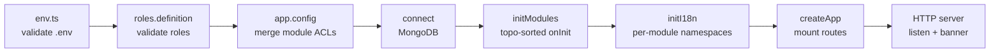

<div align="center">

# ▲ bp-backend-express

**A type-safe, modular Express foundation you actually understand.**

Not a kitchen-sink framework. Not a 40-file tutorial. A small, opinionated backbone where
permissions are checked by the compiler, modules wire themselves up, and nothing boots
until the config is proven valid.

<br/>


</div>

---

## The one idea worth stealing

Most boilerplates check permissions with magic strings sprinkled across route files:

```ts
router.get("/users", requirePermission("users:list"), handler)  // typo? you find out in prod
```

Here, a permission string that doesn't exist **won't compile** — and a route that requires a
permission no role was granted **throws at boot**, not at request time.

```ts
// acl.module.ts — declare once, per module
const { acl, defineRoutes } = defineACL({
  admin:    ["users:bo:list", "users:bo:create", "users:bo:delete"],
  user:     ["users:bo:list"],
  public:   ["users:guest:list"],
})

// bo.routes.ts — `require()` autocompletes *only this module's* permissions
defineRoutes((registry) => {
  registry
    .require("users:bo:list")       // ✅ autocompletes; unknown string = compile error
    .get("/users")
    .validate({ query: querySchema, body: bodySchema })
    .use((req, _res, next) => {
      // req.query.page is `number`, req.body.name is `string`
      // — inferred straight from the zod schemas, no casting
      if (req.query.page > 0 && req.body.name) return next()
      return next(new Error("invalid"))
    })
    .handle((req, res) => res.json({ ok: true, page: req.query.page }))
})
```

Three layers guard the same rule, on purpose:

| Layer | When it catches you | Where |
| --- | --- | --- |
| **Types** | as you type | `defineACL` → `RAIsOf<A>` narrows `require()` to your RAIs |
| **Boot** | `yarn start:dev` | unknown role / ungranted RAI throws before listening |
| **Runtime** | per request | `authorize(rai)` enforces the merged ACL on every call |

> **RAI** = *Resource Access Identifier* — a permission string shaped `module:resource:action`
> (e.g. `users:bo:list`). It's the unit everything in the access layer speaks in.

---

## What's in the box

- 🔐 **Compile-time + runtime ACL** — typed permissions, role→RAI grants merged across modules, enforced by one middleware.
- 🧩 **Self-assembling modules** — each module declares its routes, ACL, i18n, and an `onInit` hook; the loader resolves `depends` with a real topological sort (cycles throw).
- ✅ **Fail-fast config** — env vars *and* role definitions are validated with zod at startup. Bad config = the process refuses to start, with the offending key and file path printed.
- 🧪 **Zod-validated requests, inferred types** — `.validate({ query, body, params })` coerces the request *and* flows the parsed types into every downstream handler.
- 📦 **One error envelope** — every error exits through a single handler as `{ error: { code, message, details? } }`, localized per request via i18next.
- 🌍 **Per-module i18n** — each module's locale folder becomes an i18next namespace; language is detected per request and exposed as `req.t`.
- 🪵 **Production-grade logging** — Pino with secret redaction, daily/size rotation + gzip, per-request correlation IDs, pretty in dev / JSON in prod, child loggers per module.
- 🛑 **Graceful shutdown & clustering** — SIGTERM/SIGINT drains connections and closes the DB; optional cluster mode forks one worker per core.

---

## Architecture at a glance

**Boot sequence** — strictly ordered, fail-fast:



**Request lifecycle** — what every request walks through:

```mermaid
flowchart LR
  req((request)) --> log[requestLogger<br/>reqId]
  log --> json[express.json]
  json --> i18n[i18n<br/>attach req.t]
  i18n --> auth[authenticate<br/>populate req.auth]
  auth --> rai[authorize&#40;rai&#41;<br/>ACL check]
  rai --> val[.validate<br/>zod coerce]
  val --> mw[.use<br/>middlewares]
  mw --> h[.handle<br/>respond]
  rai -. denied .-> err[errorHandler]
  val -. invalid .-> err
  err --> out((envelope))
```



Two layers, deliberately separated:

- **`packages/`** — reusable, app-agnostic machinery (`acl/` is the whole permission engine). Copy it to the next project untouched.
- **`lib/`** — *this* app's policy. `access-control.ts` is where you swap the placeholder auth for real JWT; `express.ts` is where the app is assembled. Meant to be edited.

---

## Project structure

```
src/
├─ Application.ts            # entry point — boot, cluster, listen, graceful shutdown
├─ config/
│  ├─ env.ts                 # zod-validated environment (fail-fast)
│  ├─ app.config.ts          # global config; merges every module's ACL
│  ├─ roles.definition.ts    # single source of truth for role names
│  └─ logger.ts              # Pino: redaction, rotation, child loggers
├─ packages/
│  └─ acl/                   # ← reusable permission engine (types + runtime)
│     ├─ define-acl.ts       #   defineACL() → { acl, defineRoutes }
│     ├─ define-routes.ts    #   registry.require().get().validate().use().handle()
│     ├─ mount-routes.ts     #   binds routes onto an Express router w/ guards
│     ├─ schema.ts           #   zod validation of ACL shape
│     └─ errors.ts           #   HttpError hierarchy (400/401/403/404…)
├─ lib/                      # ← app-specific policy (edit these)
│  ├─ express.ts             #   assembles the app & middleware chain
│  ├─ access-control.ts      #   authenticate + authorize (JWT goes here)
│  ├─ error-handler.ts       #   the one place errors become responses
│  ├─ i18n.ts                #   i18next wiring, per-module namespaces
│  ├─ modules.ts             #   dependency-ordered module init
│  ├─ mongoose.ts            #   DB connect / disconnect / health
│  └─ http.ts                #   server + graceful shutdown
├─ modules/
│  └─ users/                 # ← a feature module (the template to copy)
│     ├─ config.module.ts    #   the module contract (name, acl, routes, onInit…)
│     ├─ acl.module.ts       #   role → RAI grants
│     ├─ routes/             #   route definitions
│     ├─ schemas/            #   zod request schemas
│     ├─ controllers/        #   handlers
│     └─ i18n/               #   en.json, fr.json → "users" namespace
└─ types/                    # ambient augmentations (req.auth, module contract)
```

---

## Getting started

**Requirements:** Node `v24` (see `.nvmrc`) · Yarn `4` (Berry) · a MongoDB instance.

```bash
# 1. Use the pinned Node version
nvm use

# 2. Install
yarn install

# 3. Configure — env files live in .envs/.env.<NODE_ENV>
cp .envs/.env.example .envs/.env.development
#   then fill in DATABASE_*, JWT_SECRET, MAILER_*

# 4. Run
yarn start:dev      # nodemon → rebuild + restart on change
```

If anything in the env or role config is wrong, the server tells you exactly what and exits —
you never get a half-booted app.

### Scripts

| Command | Does |
| --- | --- |
| `yarn start:dev` | Dev mode via nodemon — `tsc && tsc-alias && node build/Application.js` on every change |
| `yarn build` | Type-check + compile to `build/` and rewrite path aliases (`tsc-alias`) |
| `yarn start:prod` | Run the compiled build with `NODE_ENV=production` |

The API mounts at **`/api/v1`** (`prefix` + `version`, both in `app.config.ts`).

---

## Adding a module

Copy `modules/users/`, then satisfy the contract in `config.module.ts`:

```ts
export async function getModuleConfig() {
  return {
    name: "billing",
    description: "Billing module",
    version: "1.0.0",

    priority: 0,            // tie-breaker among independent modules (higher first)
    depends: ["users"],     // initialized after these (topologically sorted)

    acl,                    // role → RAI grants  (from defineACL)
    routes,                 // collected route records (from defineRoutes)

    i18nFolderPath: "./i18n",
    onInit: async () => { /* indexes, seed data, warm caches… */ },
  } satisfies ModuleConfig
}
```

Register it in `config/app.config.ts` and it self-wires: routes mounted, ACL merged into the
global policy, locale folder registered as a namespace, `onInit` run in dependency order.

---

## Configuration reference

All variables are validated in `config/env.ts`. Loaded from `.envs/.env.${NODE_ENV}`.

| Group | Keys |
| --- | --- |
| **Runtime** | `NODE_ENV` |
| **Server** | `PORT`, `HOST`, `HTTPS_ENABLED`, `CLUSTER_MODE_ENABLED` |
| **Database** | `DATABASE_PROTOCOL` (`mongodb` \| `mongodb+srv`), `DATABASE_HOST`, `DATABASE_PORT`, `DATABASE_NAME`, `DATABASE_USER`, `DATABASE_PASSWORD` |
| **Auth** | `JWT_SECRET`, `JWT_EXPIRES_IN` |
| **Mailer** | `MAILER_FROM`, `MAILER_HOST`, `MAILER_PORT`, `MAILER_SECURE`, `MAILER_AUTH_USER`, `MAILER_AUTH_PASS` |
| **Logging** *(optional)* | `LOG_LEVEL`, `LOG_DIR`, `LOG_TO_FILE` |
| **i18n** *(optional)* | `I18N_FALLBACK_LANGUAGE`, `I18N_SUPPORTED_LANGUAGES` (csv), `I18N_DEFAULT_NAMESPACE` |

### Error responses

Every error — thrown or `next()`-ed — leaves through one handler in a single shape:

```json
{
  "error": {
    "code": "FORBIDDEN",
    "message": "Access to users:bo:delete is not permitted",
    "details": { "rai": "users:bo:delete" }
  }
}
```

Messages are localized per request (`errors.<CODE>` keys via `req.t`), falling back to the
default text when no translation exists. Never write `res.status().json()` for an error —
throw an `HttpError` and let the handler keep the format unified.

---

## Roadmap & honest status

This is a **work in progress**, and a few foundations are intentionally stubbed:

- [ ] **Real authentication.** `lib/access-control.ts` currently trusts an `x-roles` header as a placeholder. Swap it for JWT verification (`config.lib.jwt`) before anything faces the internet.
- [ ] **HTTPS server.** `HTTPS_ENABLED=true` is recognized but not yet implemented.
- [ ] **Tests.** `NODE_ENV=test` is supported; no runner is wired up yet. The ACL engine is the first thing that deserves coverage.
- [ ] **Cluster-safe logging.** With `CLUSTER_MODE_ENABLED`, prefer stdout over file rotation — multiple workers shouldn't share one rotating log file.

---

<div align="center">
<sub>Built deliberately. Every layer is here because it earns its place — not because a generator added it.</sub>
</div>
