<div align="center">

# ▲ bp-backend-express

**A type-safe, modular Express foundation you actually understand.**

Not a kitchen-sink framework. Not a 40-file tutorial. A small, opinionated backbone where
permissions are checked by the compiler, modules wire themselves up, and nothing boots
until the config is proven valid.

<br/>


</div>

---

## The one idea worth stealing

Most boilerplates check permissions with magic strings sprinkled across route files:

```ts
router.get("/users", requirePermission("users:list"), handler)  // typo? you find out in prod
```

Here, a permission string that doesn't exist **won't compile** — and a route that requires a
permission no role was granted **throws at boot**, not at request time.

```ts
// acl.module.ts — declare once, per module
const { acl, defineRoutes } = defineACL({
  admin:    ["users:bo:list", "users:bo:create", "users:bo:delete"],
  user:     ["users:bo:list"],
  public:   ["users:guest:list"],
})

// bo.routes.ts — `require()` autocompletes *only this module's* permissions
defineRoutes((registry) => {
  registry
    .require("users:bo:list")       // ✅ autocompletes; unknown string = compile error
    .get("/users")
    .validate({ query: querySchema, body: bodySchema })
    .use((req, _res, next) => {
      // req.query.page is `number`, req.body.name is `string`
      // — inferred straight from the zod schemas, no casting
      if (req.query.page > 0 && req.body.name) return next()
      return next(new Error("invalid"))
    })
    .handle((req, res) => res.respond({ page: req.query.page }))
})
```

Three layers guard the same rule, on purpose:

| Layer | When it catches you | Where |
| --- | --- | --- |
| **Types** | as you type | `defineACL` → `RAIsOf<A>` narrows `require()` to your RAIs |
| **Boot** | `yarn start:dev` | unknown role / ungranted RAI throws before listening |
| **Runtime** | per request | `authorize(rai)` enforces the merged ACL on every call |

> **RAI** = *Resource Access Identifier* — a permission string shaped `module:resource:action`
> (e.g. `users:bo:list`). It's the unit everything in the access layer speaks in.

---

## What's in the box

- 🔐 **Compile-time + runtime ACL** — typed permissions, role→RAI grants merged across modules, enforced by one middleware.
- 🧱 **Composable route groups** — `prefix()` nests routes (`/categories` → `/:id`); `use()`/`param()` cascade into nested groups, `param()` handlers attach only to routes that declare them, and a param matching nothing **fails fast at boot**.
- 🧩 **Self-assembling modules** — each module declares its routes, ACL, i18n, and an `onInit` hook; the loader resolves `depends` with a real topological sort (cycles throw).
- ✅ **Fail-fast config** — env vars *and* role definitions are validated with zod at startup. Bad config = the process refuses to start, with the offending key and file path printed.
- 🧪 **Zod-validated requests, inferred types** — `.validate({ query, body, params })` coerces the request *and* flows the parsed types into every downstream handler.
- 📦 **Unified response envelope** — `res.respond(data, { status, meta })` sends `{ isOk, data, errors, meta }`, and the central error handler renders failures in the same shape. Purely additive — the full Express `res` (`json`, `send`, `redirect`, …) keeps working. Errors are localized per request via i18next.
- 🌍 **Per-module i18n** — each module's locale folder becomes an i18next namespace (named after the module); language is detected per request and exposed as `req.t`.
- 🧬 **Global Mongoose base plugin** — every schema auto-gets snake_case timestamps **and** soft delete (`is_deleted` + `deleted_at` + a polymorphic `deleted_by`); deleted docs are transparently filtered from reads/updates, with `.withDeleted()` / `.onlyDeleted()` escape hatches.
- 🗂️ **Auto-loaded models** — each module's `*.model.ts` are imported on boot (from its `modelsFolderPath`), so schemas register with Mongoose — already carrying the base plugin — before the first request.
- 🚦 **DB-backed resource toggles** — every route is mirrored to a `Resource` document on boot; a disabled resource returns `404` before your handler (or the ACL check) ever runs.
- 🪵 **Production-grade logging** — Pino with secret redaction, daily/size rotation + gzip, per-request correlation IDs, pretty in dev / JSON in prod, child loggers per module.
- 🛑 **Graceful shutdown & clustering** — SIGTERM/SIGINT drains connections and closes the DB; optional cluster mode forks one worker per core (each with its own rotating log file).

---

## Routing: groups, params & controllers

Routes are declared through a small fluent DSL. Beyond the flat `require().get()…` chain, the
registry is a **scope tree** — `prefix()` opens a group, and groups nest:

```ts
export const boRoutes = defineRoutes((registry) => {
  // Module-wide: runs before every route in this module
  registry.use(requestContext)

  const collection = registry.prefix("/categories")        // /categories
  collection.use(rateLimit)                                // ← cascades to nested routes too

  collection.require("categories:bo:list").get("").validate({ query }).handle(listCategories)
  collection.require("categories:bo:create").post("").validate({ body }).handle(createCategory)

  const item = collection.prefix("/:categoryId")           // /categories/:categoryId (nested)
  item.param("categoryId", loadCategory)                   // runs only on routes that declare :categoryId

  item.require("categories:bo:get").get("").validate({ params }).handle(getCategory)
  item.require("categories:bo:delete").delete("").validate({ params }).handle(deleteCategory)
})
```

Each route's middleware stack is assembled **outermost → innermost**:

```
module use()  →  group use() (outer→inner)  →  matched param()  →  route validate/use  →  handler
```

- **`use(fn)`** — at the registry (module-wide) or any group; cascades into nested groups.
- **`param(name, fn)`** — attaches `fn` only to routes whose **full path** declares `:name`. The
  name may come from the prefix *or* an individual route (`.get("/:id")`). A registered param
  that matches no route **throws at startup** — typos can't silently no-op.
- **`root()`** — mounts *outside* the global API prefix (`/health` instead of `/api/v1/health`)
  — for health checks, webhooks, `robots.txt`. The RAI guard and middlewares still apply; only
  the mount base changes. Works **per route** or **per group** (cascading into nested groups):
  ```ts
  // one route
  registry.require("system:health:read").get("/health").root().handle(healthCheck)

  // a whole collection — every route lives at /webhooks/*
  const webhooks = registry.prefix("/webhooks").root()
  webhooks.require("webhooks:stripe:post").post("/stripe").handle(stripeHook)
  ```
- **Controllers** — lift handlers into their own files with the exported `RouteMiddleware` /
  `RouteHandler` types, so `req.params`/`body`/`query` stay typed:

```ts
// controllers/bo.controllers.ts
import type { RouteHandler } from "@packages/acl/define-routes.js"
type Params = z.infer<typeof paramsSchema>

export const getCategory: RouteHandler<Params> = (req, res) =>
  res.respond({ id: req.params.categoryId })
```

It all resolves to a plain `RouteRecord[]`, so the mount layer never needs to know groups exist.

---

## Architecture at a glance

**Boot sequence** — strictly ordered, fail-fast:

```mermaid
flowchart LR
  P[register<br/>global base plugin] --> A[env.ts<br/>validate .env]
  A --> B[roles.definition<br/>validate roles]
  B --> C[app.config<br/>merge module ACLs]
  C --> M[loadModels<br/>register schemas]
  M --> D[connect<br/>MongoDB]
  D --> E[initModules<br/>topo-sorted onInit]
  E --> F[initI18n<br/>per-module namespaces]
  F --> G[createApp<br/>mount routes]
  G --> H[HTTP server<br/>listen + banner]
```



> The Mongoose base plugin is registered via a side-effect import **first** —
> before any schema compiles — so every model picks up timestamps + soft delete.
> `loadModels` then imports each module's `*.model.ts`, and `initModules` runs the
> `onInit` hooks (e.g. core's syncs every route into a `Resource` document).

**Request lifecycle** — what every request walks through:

```mermaid
flowchart LR
  req((request)) --> log[requestLogger<br/>reqId]
  log --> json[express.json]
  json --> i18n[i18n<br/>attach req.t]
  i18n --> auth[authenticate<br/>populate req.auth]
  auth --> en[resource enabled?<br/>DB check]
  en --> rai[authorize&#40;rai&#41;<br/>ACL check]
  rai --> val[.validate<br/>zod coerce]
  val --> mw[.use<br/>middlewares]
  mw --> h[.handle<br/>respond]
  en -. disabled .-> err[errorHandler]
  rai -. denied .-> err
  val -. invalid .-> err
  err --> out((envelope))
```



Two layers, deliberately separated:

- **`packages/`** — reusable, app-agnostic machinery (`acl/` is the whole permission engine). Copy it to the next project untouched.
- **`lib/`** — *this* app's policy. `access-control.ts` is where you swap the placeholder auth for real JWT; `express.ts` is where the app is assembled. Meant to be edited.

---

## Project structure

```
src/
├─ Application.ts            # entry point — boot, cluster, listen, graceful shutdown
├─ config/
│  ├─ env.ts                 # zod-validated environment (fail-fast)
│  ├─ app.config.ts          # global config; merges every module's ACL
│  ├─ roles.definition.ts    # single source of truth for role names
│  └─ logger.ts              # Pino: redaction, rotation, child loggers
├─ packages/                 # ← reusable, app-agnostic machinery (copy as-is)
│  ├─ acl/                   #   the permission engine (types + runtime)
│  │  ├─ define-acl.ts       #     defineACL() → { acl, defineRoutes }
│  │  ├─ define-routes.ts    #     route DSL — require().get()…  ·  prefix() groups, use()/param()
│  │  ├─ mount-routes.ts     #     binds routes onto an Express router w/ guards
│  │  ├─ schema.ts           #     zod validation of ACL shape
│  │  └─ errors.ts           #     HttpError hierarchy (400/401/403/404…)
│  └─ mongoose/              #   Mongoose base plugin
│     ├─ register.ts         #     mongoose.plugin(baseModelPlugin) — global, import first
│     └─ plugins/            #     timestamps + soft-delete (composed in base.plugin.ts)
├─ lib/                      # ← app-specific policy (edit these)
│  ├─ express.ts             #   assembles the app & middleware chain
│  ├─ access-control.ts      #   authenticate + resource-enabled + authorize (JWT goes here)
│  ├─ error-handler.ts       #   the one place errors become responses
│  ├─ i18n.ts                #   i18next wiring, per-module namespaces
│  ├─ modules.ts             #   topo-sorted init + loadModuleModels()
│  ├─ mongoose.ts            #   DB connect / disconnect / health
│  └─ http.ts                #   server + graceful shutdown
├─ helpers/                  # small pure utilities (jwt, startup-banner, …)
├─ modules/
│  ├─ core/                  # ← built-in module: resource registry
│  │  ├─ models/             #   resource.model.ts (RAI ↔ route mirror)
│  │  └─ config.module.ts    #   onInit upserts a Resource per route
│  └─ users/                 # ← a feature module (the template to copy)
│     ├─ config.module.ts    #   the module contract (name, acl, routes, onInit…)
│     ├─ acl.module.ts       #   role → RAI grants
│     ├─ routes/             #   route definitions (groups, params, controllers)
│     ├─ schemas/            #   zod request schemas
│     ├─ controllers/        #   handlers typed via RouteMiddleware / RouteHandler
│     ├─ models/             #   *.model.ts — auto-loaded on boot
│     └─ i18n/               #   en.json, fr.json → "users" namespace
└─ types/                    # ambient augmentations (req.auth, module contract)

scripts/
├─ clean.mjs                 # wipes build/ before a fresh compile (no stale .js)
├─ copy-assets.mjs           # copies non-TS assets (i18n JSON, …) src/ → build/
└─ generate-jwt-keys.mjs     # generates an RS256 key pair for JWT (yarn keys:jwt)
```

---

## Getting started

**Requirements:** Node `v24` (see `.nvmrc`) · Yarn `4` (Berry) · a MongoDB instance.

```bash
# 1. Use the pinned Node version
nvm use

# 2. Install
yarn install

# 3. Configure — env files live in .envs/.env.<NODE_ENV>
cp .envs/.env.example .envs/.env.development
#   then fill in DATABASE_*, MAILER_*

# 4. Generate a JWT signing key pair (RS256) straight into the env file
yarn keys:jwt --env development
#   (or `yarn keys:jwt` to print the JWT_* lines; HS256 also works — set JWT_ALGORITHM)

# 5. Run
yarn start:dev      # nodemon → rebuild + restart on change
```

If anything in the env or role config is wrong, the server tells you exactly what and exits —
you never get a half-booted app.

### Scripts

| Command | Does |
| --- | --- |
| `yarn start:dev` | Dev via nodemon — runs `yarn build` then `node build/Application.js`, restarting on any `.ts`/`.json` change |
| `yarn build` | Clean `build/`, type-check, compile, rewrite `@` aliases (`tsc-alias`), then copy non-TS assets |
| `yarn clean` | Remove `build/` — so renamed/deleted sources don't leave stale `.js` (which the model auto-loader would otherwise import) |
| `yarn copy:assets` | Copy non-TS assets (i18n JSON, …) `src/ → build/` — `tsc` only emits `.js` |
| `yarn keys:jwt` | Generate an RS256 key pair for JWT; `--env <name>` writes it into `.envs/.env.<name>` |
| `yarn start:prod` | Run the compiled build with `NODE_ENV=production` |

The API mounts at **`/api/v1`** (`prefix` + `version`, both in `app.config.ts`).

### Path aliases

Two alias systems, each for a different stage:

| Alias | Resolved by | Points at | Use in |
| --- | --- | --- | --- |
| `@/*`, `@lib/*`, `@config/*`, … | TypeScript + `tsc-alias` (compile time) | `src/*` | typed `.ts` source |
| `#/*`, `#lib/*`, `#config/*`, … | Node.js `imports` (runtime) | `build/*` | plain `.mjs` scripts |

`@` aliases are rewritten to relative paths during the build; `#` aliases are real Node subpath
imports (they must start with `#`), handy in standalone scripts that run the compiled output.

---

## Adding a module

Copy `modules/users/`, then satisfy the contract in `config.module.ts`:

```ts
export async function getModuleConfig() {
  return {
    name: "billing",        // ⚠️ must equal the folder name — it's the i18n namespace
                            //    and how models/locale folders are resolved on disk
    description: "Billing module",
    version: "1.0.0",

    priority: 0,            // tie-breaker among independent modules (higher first)
    depends: ["users"],     // initialized after these (topologically sorted)

    acl,                    // role → RAI grants  (from defineACL)
    routes,                 // collected route records (from defineRoutes)

    i18nFolderPath: "./i18n",     // → "billing" i18next namespace
    modelsFolderPath: "./models", // → *.model.ts here auto-load on boot
    onInit: async () => { /* indexes, seed data, warm caches… */ },
  } satisfies ModuleConfig
}
```

Add it to the `moduleRegistry` in `config/app.config.ts` (keyed by folder name) and it
self-wires: models loaded, routes mounted, ACL merged into the global policy, locale folder
registered as a namespace, `onInit` run in dependency order.

---

## Models & soft delete

A single global plugin (`packages/mongoose`) is registered before any schema compiles, so
**every** model inherits the same base shape — no per-schema wiring:

```ts
// modules/<module>/models/thing.model.ts
import mongoose, { Schema } from "mongoose"
import type { BaseDocument } from "@packages/mongoose/plugins/base.plugin.js"

export interface IThing extends BaseDocument { name: string }  // BaseDocument<string> for a string _id

export const ThingModel = mongoose.model<IThing>("Thing", new Schema({ name: String }))
// auto-loaded on boot — no import needed elsewhere
```

Every document then carries:

| Field | Added by | Notes |
| --- | --- | --- |
| `created_at` / `updated_at` | timestamps plugin | snake_case, Mongoose-managed |
| `is_deleted` | soft-delete plugin | indexed; `false` by default |
| `deleted_at` | soft-delete plugin | `null` until deleted |
| `deleted_by` | soft-delete plugin | polymorphic `{ model, id }` (populate-able via `refPath`), or `null` |

**Soft delete is the default read model.** Deleted docs are transparently excluded from
`find*`, `count*`, `update*`, and aggregations — opt back in explicitly:

```ts
await doc.softDelete(actor)          // actor = { model: "User", id }  (optional)
await Model.softDelete(filter, actor)// bulk
await doc.restore()                  //   /  await Model.restore(filter)

Model.find()                         // live docs only (default)
Model.find().withDeleted()           // include soft-deleted
Model.find().onlyDeleted()           // only soft-deleted
```

Hard deletes (`deleteOne` / `deleteMany`) are left literal — they bypass the soft-delete guard.

---

## Configuration reference

All variables are validated in `config/env.ts`. Loaded from `.envs/.env.${NODE_ENV}`.

| Group | Keys |
| --- | --- |
| **Runtime** | `NODE_ENV` |
| **Server** | `PORT`, `HOST`, `HTTPS_ENABLED`, `CLUSTER_MODE_ENABLED` |
| **Database** | `DATABASE_PROTOCOL` (`mongodb` \| `mongodb+srv`), `DATABASE_HOST`, `DATABASE_PORT`, `DATABASE_NAME`, `DATABASE_USER`, `DATABASE_PASSWORD` |
| **Auth (JWT)** | `JWT_ALGORITHM` (`HS256` \| `RS256` \| `ES256`), `JWT_PRIVATE_KEY`, `JWT_PUBLIC_KEY`, `JWT_EXPIRES_IN`, `JWT_REFRESH_EXPIRES_IN` |
| **Mailer** | `MAILER_FROM`, `MAILER_HOST`, `MAILER_PORT`, `MAILER_SECURE`, `MAILER_AUTH_USER`, `MAILER_AUTH_PASS` |
| **Logging** *(optional)* | `LOG_LEVEL`, `LOG_DIR`, `LOG_TO_FILE` |
| **i18n** *(optional)* | `I18N_FALLBACK_LANGUAGE`, `I18N_SUPPORTED_LANGUAGES` (csv), `I18N_DEFAULT_NAMESPACE` |

### Unified responses

Every endpoint returns one envelope — success and error alike:

```jsonc
// success — res.respond(data, { status?, meta? })
{ "isOk": true,  "data": { "id": "42" }, "errors": [], "meta": { "pagination": { "page": 1, "total": 87 } } }

// error — thrown HttpError / failed validation, rendered by the central handler
{ "isOk": false, "data": null, "errors": [{ "code": "FORBIDDEN", "message": "Access denied" }], "meta": {} }
```

- **Success** → `res.respond(data, { status, meta })`. `meta` carries `pagination`, `action`, or anything else.
- **Errors** → **throw** an `HttpError` (or `next(err)`); the one central handler renders the same shape.
  A failed `.validate()` yields one entry per field (each with a `path`).
- **Purely additive.** `res.respond()` sits *alongside* the full Express response — `res.json`, `res.send`,
  `res.status()`, `res.redirect()` all keep working untouched. Reach for `respond()` when you want the
  unified envelope; drop to the raw senders when you need something else. (`res.render()` is a natural
  companion to add later.)

Error messages are localized per request (`errors.<CODE>` keys via `req.t`), falling back to the
default text when no translation exists.

---

## Roadmap & honest status

This is a **work in progress**, and a few foundations are intentionally stubbed:

- [ ] **Real authentication.** The JWT config (`config.lib.jwt`) and a key generator (`yarn keys:jwt`) are in place, but `helpers/jwt` is still a stub and `lib/access-control.ts` trusts an `x-roles` header. Wire up sign/verify and swap the placeholder before anything faces the internet.
- [ ] **HTTPS server.** `HTTPS_ENABLED=true` is recognized but not yet implemented.
- [ ] **Tests.** `NODE_ENV=test` is supported; no runner is wired up yet. The ACL engine is the first thing that deserves coverage.
- [ ] **JWT token helper.** `helpers/jwt/generateJWTTokens` is scaffolded but returns empty tokens — implement sign + refresh against `config.lib.jwt`.

Already handled (not on the list): cluster-safe logging — each worker writes its own `app-worker-<slot>.log`, so rotation never races.

---

<div align="center">
<sub>Built deliberately. Every layer is here because it earns its place — not because a generator added it.</sub>
</div>
